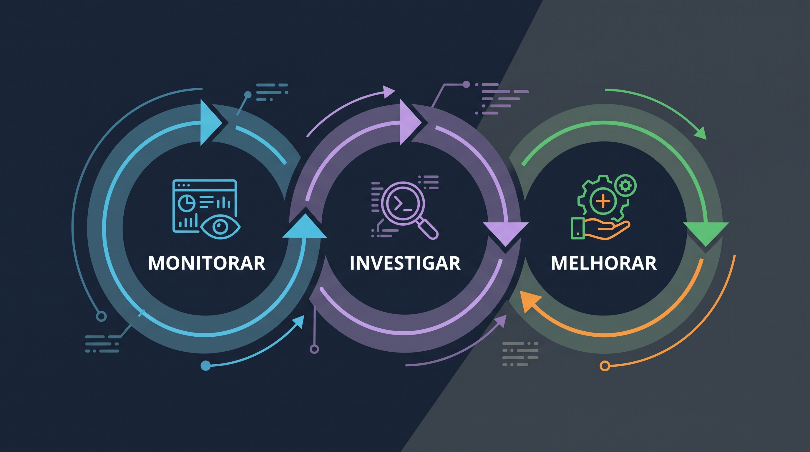

# Monitoramento e Observabilidade: qual a diferença?

Quando desenvolvemos um sistema, precisamos ter alguma forma de acompanhar o que está acontecendo com ele. Afinal, não basta colocar uma aplicação em produção e assumir que tudo vai continuar funcionando como deveria. Problemas acontecem. Sempre! Comportamentos inesperados aparecem e muitas vezes, só percebemos que alguma coisa está errada quando alguém começa a reclamar e, geralmente, o primeiro a reclamar é o usuário.

É justamente nesse contexto que entram o monitoramento e a observabilidade. Apesar de serem conceitos diferentes, ambos estão relacionados à capacidade de entender o comportamento de um sistema a partir dos dados que ele produz. "Monitoramento e Observabilidade são dois processos distintos baseados em dados" [AWS].

Mas qual é a diferença entre eles e por que precisamos dos dois?

## Monitoramento

Pensando de maneira geral, monitorar um sistema é acompanhar determinados sinais para saber se tudo está funcionando dentro do esperado. Para isso, precisamos definir o que queremos acompanhar e quais condições indicam que alguma coisa pode estar errada. Em outras palavras, quando precisamos entender a saúde de um sistema, o primeiro passo é definir quais perguntas queremos responder (o que monitorar) e, com base nelas, definir as respostas (quais sinais usar e o ponto de onde eles serão emitidos).

Por exemplo, podemos acompanhar o consumo de memória de uma aplicação, a quantidade de erros que ela está retornando ou o tempo que determinada operação leva para ser concluída. Se algum desses indicadores ultrapassar um limite que consideramos aceitável, podemos disparar um alerta para que alguém investigue o que está acontecendo.

Para fazer isso, podemos utilizar métricas, logs, traces, eventos e outros dados produzidos pelo sistema. Esses dados podem alimentar dashboards, alertas e outras ferramentas que nos ajudam a acompanhar a saúde da aplicação e da infraestrutura.

O ponto chave aqui é que o monitoramento funciona muito bem para identificar problemas e comportamentos que já conhecemos ou conseguimos antecipar (as perguntas e respostas que eu citei no início). O problema é que nem tudo o que pode dar errado em um sistema é conhecido previamente. E mesmo quando um alerta indica que alguma coisa está errada, ele não necessariamente nos diz o motivo daquilo estar acontecendo.

É aí que a observabilidade começa a fazer diferença.

## Observabilidade

Enquanto o monitoramento está mais relacionado a acompanhar condições que já conhecemos, a observabilidade está relacionada à nossa capacidade de entender o que está acontecendo dentro de um sistema a partir das informações que ele produz.

Parece uma diferença sutil à primeira vista, mas ela é bem relevante.

Imagine que estamos acompanhando o tempo de resposta de determinada operação e percebemos que ele aumentou consideravelmente. Pelo monitoramento, conseguimos identificar que existe um problema. Mas o que provocou esse aumento? Foi alguma alteração recente na aplicação? Uma consulta ao banco de dados que ficou mais lenta? Um serviço externo que está demorando para responder?

São perguntas que talvez não tenhamos considerado quando configuramos nossos dashboards e alertas ou quando desenvolvemos o sistema.

A ideia da observabilidade é justamente permitir que consigamos investigar situações como essas, inclusive fazendo perguntas que não foram planejadas quando o sistema foi desenvolvido ou quando os mecanismos de monitoramento foram configurados.

As métricas nos ajudam a entender o comportamento do sistema de maneira quantitativa, acompanhando informações como latência, taxa de erros e consumo de recursos. Os logs registram acontecimentos e informações sobre a execução da aplicação. Já os traces permitem acompanhar o caminho percorrido por uma operação, inclusive quando ela passa por diferentes serviços. Em breve, trago um post explicando melhor cada um deles.

O interessante é que esses dados se tornam ainda mais úteis quando conseguimos relacioná-los. Por exemplo, utilizando identificadores que permitam encontrar os logs associados a uma determinada requisição e relacioná-los ao trace daquela operação.

Mas nem tudo são flores, não poderia ser “simples assim”. Apenas a coleta de métricas, logs e traces não significa que um sistema tenha boa observabilidade. As respostas trazidas por esses sinais devem fazer sentido, com detalhes do contexto e situação onde aquele sinal foi emitido. Além disso, eles precisam trazer alguma forma que possibilite a relação entre eles e assim, ajude a entender o comportamento da aplicação.

## Um exemplo prático: transferência pelo aplicativo

Vamos imaginar uma situação relativamente comum em uma aplicação financeira onde uma pessoa abre o aplicativo para realizar uma transferência. Ao confirmá-la, o sistema precisa executar uma série de etapas: validar os dados informados, consultar o saldo disponível, realizar verificações de segurança e enviar a transferência para processamento. Tudo isso acontece enquanto a pessoa olha para uma tela de loading no aplicativo.

Agora imagine que essa transferência, que normalmente é concluída em poucos segundos, começa a demorar muito mais do que deveria. Depois de algum tempo aguardando, a pessoa recebe uma mensagem informando que não foi possível conclui-la.

Do ponto de vista de quem está utilizando o aplicativo, a transferência falhou. Mas, para quem desenvolve e mantém esse sistema, existe uma série de possibilidades que podem explicar o problema.

Com o monitoramento, podemos identificar que o tempo de resposta das transferências aumentou e que a quantidade de operações terminando em erro também está crescendo. Dependendo dos limites que configuramos, um alerta pode ser disparado para avisar o time responsável.

A transferência passou por diferentes serviços e validações antes de retornar o erro. Pode ser que a consulta ao saldo tenha demorado, que a validação de segurança tenha encontrado algum ponto de atenção ou que o serviço responsável pelo processamento da transação não esteja respondendo corretamente.

É nesse momento que os dados de observabilidade entram na investigação.

Se tivermos métricas relacionadas às diferentes etapas da operação, podemos identificar onde o tempo de resposta começou a aumentar. Com logs contextualizados, conseguimos consultar informações sobre as validações realizadas e os erros encontrados. E, utilizando um trace, podemos acompanhar o caminho percorrido pela requisição, desde o aplicativo até os serviços envolvidos, identificando quanto tempo foi gasto em cada chamada.

Com essas informações, conseguimos investigar o que aconteceu com muito mais precisão, sem precisar assumir que a causa do problema está necessariamente no serviço que retornou o erro final.

E isso faz bastante diferença, especialmente em sistemas distribuídos, onde uma única operação pode depender de diversos serviços para ser concluída.

## Como monitoramento e observabilidade se complementam?

O ponto aqui é que monitoramento e observabilidade não são abordagens concorrentes. Na verdade, uma complementa a outra.

O monitoramento nos ajuda a perceber que alguma coisa merece atenção. A observabilidade nos dá condições de investigar o que está acontecendo e tentar entender as causas e consequências daquele comportamento.

Voltando ao exemplo da transferência, podemos receber um alerta informando que a taxa de erros aumentou. A partir desse alerta, começamos a investigar os dados disponíveis para entender quais operações foram afetadas, em que momento o problema começou e quais serviços podem estar envolvidos.

Talvez descubramos que uma dependência está demorando mais do que o normal para responder. Ou que determinada validação passou a apresentar um comportamento inesperado depois de uma atualização. Com as informações disponíveis, conseguimos formular hipóteses, investigar essas possibilidades e tomar decisões sobre como mitigar o problema.

E tem outro ponto interessante nisso tudo: a própria investigação pode nos ajudar a melhorar o monitoramento.

Se identificamos um comportamento que não estava sendo acompanhado adequadamente, podemos adicionar novos sinais, ajustar alertas ou melhorar a instrumentação da aplicação para que situações semelhantes sejam identificadas mais rapidamente no futuro.

Ou seja, existe também um processo de evolução contínua entre monitorar, investigar e melhorar a forma como acompanhamos nossos sistemas.

 

*Ciclo de melhoria contínua no processo de monitoramento e observabilidade.*

 

No fim das contas, não basta saber que um sistema está apresentando problemas. Precisamos ter condições de entender o que aconteceu e, principalmente, reunir informações suficientes para tomar uma decisão.

> Monitorar é acompanhar aquilo que sabemos que precisa de atenção. Ter observabilidade é conseguir investigar o sistema mesmo diante de situações que não conseguimos antecipar.

Uma coisa não substitui a outra. Podemos ter diversos dashboards e alertas e ainda assim enfrentar dificuldades enormes para descobrir a causa de um problema. Da mesma forma, podemos coletar uma quantidade enorme de dados e não perceber que alguma coisa está errada porque não temos mecanismos adequados para acompanhar esses sinais.

É por isso que monitoramento e observabilidade precisam caminhar juntos. Afinal, tão importante quanto identificar que alguma coisa deu errado é conseguir entender o que aconteceu e ter informações para evitar que o mesmo problema continue acontecendo.

# Referências

- [AWS - Qual é a diferença entre observabilidade e monitoramento?](https://aws.amazon.com/pt/compare/the-difference-between-monitoring-and-observability/)
- [Observabilidade vs. monitoramento](https://www.ibm.com/br-pt/think/topics/observability-vs-monitoring)