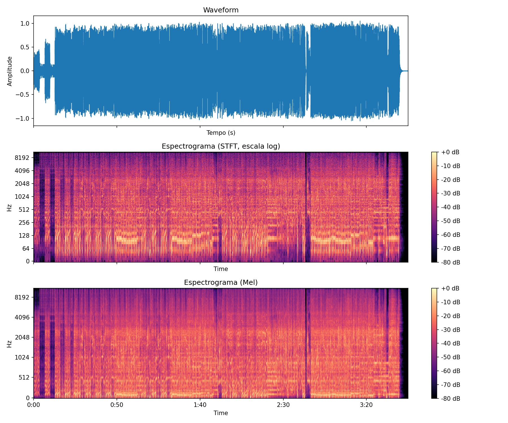

Se você já trabalhou com áudio, provavelmente já esbarrou na palavra **espectrograma**. Ele é uma das formas mais poderosas de visualizar um sinal de áudio porque mostra ao mesmo tempo o que uma forma de onda simples não consegue: quais frequências estão presentes no som e como elas mudam ao longo do tempo.

Neste post vamos entender o que é um espectrograma, por que ele é diferente (e complementar) à waveform, e como gerar espectrogramas de uma música usando Python. No final, você vai ter um script completo e comentado, pronto para usar.

---

## O que é um espectrograma

Um **espectrograma** é uma representação visual de como o conteúdo de frequência de um sinal de áudio varia ao longo do tempo. É basicamente um gráfico em três dimensões "achatado" em duas: o eixo X representa o tempo, o eixo Y representa a frequência, e a cor ou intensidade indica a amplitude (ou energia) daquela frequência naquele instante.

Tecnicamente, o espectrograma é calculado a partir da **Transformada de Fourier de Curto Prazo** (STFT — *Short-Time Fourier Transform*). A ideia é simples: o sinal de áudio é dividido em pequenos trechos sobrepostos (janelas), para cada janela aplica-se a Transformada de Fourier (que converte o sinal do domínio do tempo para o domínio da frequência), e o resultado de cada janela vira uma "fatia vertical" do espectrograma. Empilhando todas as fatias lado a lado, temos o espectrograma completo.

### Como analisar um espectrograma

Ao olhar para um espectrograma, alguns padrões visuais ajudam bastante na leitura: linhas horizontais brilhantes e constantes geralmente indicam tons puros ou notas sustentadas (como um vocal segurando uma nota, ou o zumbido de 60 Hz da rede elétrica). Faixas verticais representam eventos transientes, como uma batida de bumbo ou uma palma. Padrões repetitivos podem indicar um ritmo, um riff ou uma progressão harmônica.

Energia concentrada na parte de baixo da imagem significa sons graves, como kick drum e baixo. Energia espalhada no topo são agudos: hi-hats, pratos, sibilância vocal, ruído.

A escala de frequência costuma ser exibida em **log** (escala logarítmica) porque a percepção humana de altura sonora também é logarítmica. É por isso que costumamos usar a escala **Mel**, que aproxima como o ouvido humano realmente percebe as frequências.

---

## Espectrograma vs. waveform

É comum confundir os dois, mas eles mostram informações bem diferentes sobre o mesmo áudio:

| Aspecto | Waveform | Espectrograma |
|---|---|---|
| O que representa | Amplitude do sinal ao longo do tempo | Frequência (e sua intensidade) ao longo do tempo |
| Eixos | X = tempo, Y = amplitude | X = tempo, Y = frequência, cor = intensidade |
| Mostra conteúdo de frequência? | Não diretamente | Sim, é o foco principal |
| Bom para identificar | Volume, picos de amplitude, silêncios, transientes gerais | Timbre, notas musicais, harmônicos, ruído, vazamento de frequência |

Em resumo: a **waveform** responde "quando o som é mais forte ou mais fraco?", enquanto o **espectrograma** responde "quais frequências compõem o som em cada momento?". Na prática, engenheiros de áudio e pesquisadores de ML costumam usar os dois em conjunto — a waveform para uma visão geral rápida, e o espectrograma para uma análise mais profunda do conteúdo espectral.

---

## Gerando espectrogramas com Python

Vamos usar a biblioteca [`librosa`](https://librosa.org/), que é o padrão de fato para processamento de áudio em Python, junto com `matplotlib` para plotar os gráficos.

### Instalação

```bash
pip install librosa matplotlib numpy soundfile
```

### Script completo

```python
"""
gerar_espectrograma.py

Gera e salva o espectrograma (e a waveform) de um arquivo de áudio.
Uso:
    python gerar_espectrograma.py caminho/para/musica.wav
"""

import sys
import numpy as np
import librosa
import librosa.display
import matplotlib.pyplot as plt


def carregar_audio(caminho_arquivo, sr=22050):
    """
    Carrega um arquivo de áudio.

    Parâmetros
    ----------
    caminho_arquivo : str
        Caminho para o arquivo de áudio (wav, mp3, flac, etc.)
    sr : int
        Taxa de amostragem alvo (sample rate). librosa reamostra
        automaticamente para esse valor.

    Retorna
    -------
    y : np.ndarray
        Sinal de áudio (amplitude ao longo do tempo).
    sr : int
        Taxa de amostragem efetivamente usada.
    """
    y, sr = librosa.load(caminho_arquivo, sr=sr)
    return y, sr


def plotar_waveform(y, sr, ax=None):
    """Plota a forma de onda (waveform) do sinal."""
    if ax is None:
        _, ax = plt.subplots(figsize=(12, 3))
    librosa.display.waveshow(y, sr=sr, ax=ax)
    ax.set(title="Waveform", xlabel="Tempo (s)", ylabel="Amplitude")
    return ax


def gerar_espectrograma_stft(y, sr, n_fft=2048, hop_length=512):
    """
    Gera um espectrograma clássico usando STFT (Short-Time Fourier Transform).

    Parâmetros
    ----------
    n_fft : int
        Tamanho da janela usada na FFT. Valores maiores dão mais
        resolução de frequência, porém menos resolução temporal.
    hop_length : int
        Quantas amostras a janela "anda" a cada passo. Valores menores
        geram mais colunas (mais resolução temporal), porém mais custo
        computacional.

    Retorna
    -------
    S_db : np.ndarray
        Espectrograma em decibéis (escala logarítmica de amplitude),
        pronto para visualização.
    """
    stft = librosa.stft(y, n_fft=n_fft, hop_length=hop_length)
    S = np.abs(stft)  # magnitude (descarta a fase)
    S_db = librosa.amplitude_to_db(S, ref=np.max)
    return S_db, hop_length


def gerar_espectrograma_mel(y, sr, n_fft=2048, hop_length=512, n_mels=128):
    """
    Gera um espectrograma na escala Mel, que aproxima a percepção
    humana de frequência. Muito usado em machine learning (ex: como
    entrada para redes neurais em tarefas de reconhecimento de áudio).
    """
    mel_spec = librosa.feature.melspectrogram(
        y=y, sr=sr, n_fft=n_fft, hop_length=hop_length, n_mels=n_mels
    )
    mel_spec_db = librosa.power_to_db(mel_spec, ref=np.max)
    return mel_spec_db, hop_length


def plotar_espectrograma(S_db, sr, hop_length, escala_y="log", titulo="Espectrograma", ax=None):
    """Plota um espectrograma já calculado (em dB)."""
    if ax is None:
        _, ax = plt.subplots(figsize=(12, 4))
    img = librosa.display.specshow(
        S_db,
        sr=sr,
        hop_length=hop_length,
        x_axis="time",
        y_axis=escala_y,
        ax=ax,
        cmap="magma",
    )
    ax.set(title=titulo)
    return img, ax


def main(caminho_arquivo):
    y, sr = carregar_audio(caminho_arquivo)

    fig, axs = plt.subplots(3, 1, figsize=(12, 10))

    # 1. Waveform
    plotar_waveform(y, sr, ax=axs[0])

    # 2. Espectrograma STFT (escala log de frequência)
    S_db, hop_length = gerar_espectrograma_stft(y, sr)
    img1, _ = plotar_espectrograma(
        S_db, sr, hop_length, escala_y="log",
        titulo="Espectrograma (STFT, escala log)", ax=axs[1]
    )
    fig.colorbar(img1, ax=axs[1], format="%+2.0f dB")

    # 3. Espectrograma Mel (mais usado em ML)
    mel_db, hop_length = gerar_espectrograma_mel(y, sr)
    img2, _ = plotar_espectrograma(
        mel_db, sr, hop_length, escala_y="mel",
        titulo="Espectrograma (Mel)", ax=axs[2]
    )
    fig.colorbar(img2, ax=axs[2], format="%+2.0f dB")

    plt.tight_layout()

    saida = "espectrograma_saida.png"
    plt.savefig(saida, dpi=150)
    print(f"Espectrograma salvo em: {saida}")
    plt.show()


if __name__ == "__main__":
    if len(sys.argv) < 2:
        print("Uso: python gerar_espectrograma.py caminho/para/musica.wav")
        sys.exit(1)

    main(sys.argv[1])
```

### Rodando o script

```bash
python gerar_espectrograma.py minha_musica.wav
```

O script vai gerar uma figura com três gráficos empilhados: a waveform, o espectrograma STFT e o espectrograma Mel, salvando tudo em `espectrograma_saida.png`.

### Versão rápida

Se você só quer o espectrograma sem tanta estrutura, isso já resolve:

```python
import librosa
import librosa.display
import matplotlib.pyplot as plt
import numpy as np

y, sr = librosa.load("minha_musica.wav")
S = np.abs(librosa.stft(y))
S_db = librosa.amplitude_to_db(S, ref=np.max)

librosa.display.specshow(S_db, sr=sr, x_axis="time", y_axis="log", cmap="magma")
plt.colorbar(format="%+2.0f dB")
plt.title("Espectrograma")
plt.tight_layout()
plt.savefig("espectrograma.png")
plt.show()
```

---

## Aplicação prática: "That's the Way I Wanna Rock and Roll" (AC/DC)

Para tornar tudo mais concreto, usei como exemplo a faixa **"That's the Way I Wanna Rock and Roll"**, do AC/DC:



Rodando o script sobre essa faixa, o resultado é a imagem abaixo, com os três gráficos empilhados.



Espectrograma de "That's the Way I Wanna Rock and Roll" do AC/DC

Dois pontos ficam bem evidentes ao analisar essa imagem. O primeiro é **a guitarra no início da música**: logo nos primeiros segundos, o riff aparece nos espectrogramas como faixas de energia concentradas nas frequências médias e médio-agudas, com harmônicos bem definidos se repetindo no eixo do tempo. É um padrão característico de um instrumento com afinação bem definida, bem diferente do "borrão" de energia que o mesmo riff produz na waveform.

O segundo é **o break no minuto 2:47**, que é o ponto mais fácil de identificar em qualquer um dos três gráficos. Na waveform, a amplitude despenca visivelmente por um instante. Nos dois espectrogramas, a mesma região aparece como uma faixa vertical muito mais escura, indicando uma queda abrupta de energia em praticamente todas as frequências ao mesmo tempo, típica de uma pausa na instrumentação.

Esse tipo de análise mostra bem o valor de olhar os três gráficos juntos: a waveform entrega uma pista rápida de que "algo aconteceu" naquele instante, mas é o espectrograma que confirma que se trata de uma queda de energia em várias faixas de frequência simultaneamente, e não apenas em uma banda isolada.

---

## Sobre as bibliotecas usadas

- **[librosa](https://librosa.org/)**: biblioteca padrão para análise de áudio em Python. Ela cuida de carregar arquivos de áudio (`librosa.load`), calcular a STFT (`librosa.stft`), gerar espectrogramas Mel (`librosa.feature.melspectrogram`), converter amplitude/potência para decibéis e ainda oferece funções de plotagem prontas (`librosa.display`). É construída em cima do `numpy` e do `scipy`.

- **[numpy](https://numpy.org/)**: usada principalmente para operações numéricas, como calcular o valor absoluto da STFT (`np.abs`), que transforma os números complexos retornados pela FFT em magnitudes reais, descartando a informação de fase (que não é necessária para visualização).

- **[matplotlib](https://matplotlib.org/)**: biblioteca de plotagem. É usada para criar as figuras, os eixos e salvar as imagens em disco. O `librosa.display.specshow` usa o matplotlib por baixo dos panos para desenhar o espectrograma com os eixos de tempo e frequência corretamente escalados.

- **[soundfile](https://pypi.org/project/PySoundFile/)**: dependência usada pelo `librosa` para leitura de diferentes formatos de áudio, como WAV e FLAC. Para MP3, o `librosa` costuma depender também do `audioread` ou do `ffmpeg` instalado no sistema.

---

## Referências

- Documentação oficial do librosa: https://librosa.org/doc/latest/index.html
- Documentação do NumPy: https://numpy.org/doc/
- Documentação do Matplotlib: https://matplotlib.org/stable/index.html
- Smith, J.O. *Spectral Audio Signal Processing*, Center for Computer Research in Music and Acoustics (CCRMA), Stanford University. https://ccrma.stanford.edu/~jos/sasp/
- Wikipedia: Short-time Fourier transform — https://en.wikipedia.org/wiki/Short-time_Fourier_transform
- Wikipedia: Mel scale — https://en.wikipedia.org/wiki/Mel_scale
